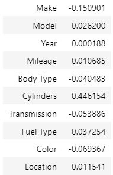
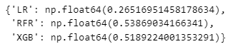
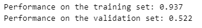
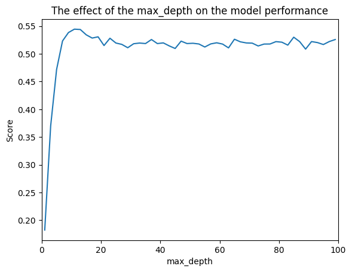
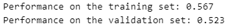

# Project Title: Car Price Prediction in UAE

This project uses machine learning to predict car prices based on various features such as make, model, year, mileage, and more.

It's designed to help car buyers and sellers in the UAE to make informed decisions by providing an estimate of a car's market value.

## Table of Contents

- [Overview](#overview)
- [Technologies Used](#technologies-used)
- [Dataset](#dataset)
- [Data Cleaning and Preprocessing](#data-cleaning-and-preprocessing)
- [Exploratory Data Analysis (EDA)](#exploratory-data-analysis-eda)
- [Feature Engineering](#feature-engineering)
- [Data Splitting](#data-splitting)
- [Model Training](#model-training)
- [Model Training](#model-training)
- [Communicating Results](#communicating-results)
- [Future Improvement](#future-improvement)
- [Conclusions](#conclusions)

## Overview

This project is a car price prediction model that uses machine learning algorithms to predict the price of used cars in the UAE. The model is trained on a dataset containing various features such as make, model, year, mileage, and more.

The goal is to provide an accurate estimate of a car's market value based on these features.

## Technologies Used

- **Python:** The programming language used for data analysis and machine learning.

- **Pandas:** A data manipulation library used for data cleaning and preprocessing.

- **NumPy:** A library for numerical computations in Python.

- **Matplotlib:** A plotting library used for data visualization.

- **Seaborn:** A data visualization library based on Matplotlib, used for creating informative and attractive statistical graphics.

- **Scikit-learn:** A machine learning library used for building and evaluating the prediction model.

- **XGBoost:** An optimized gradient boosting library designed to be highly efficient, flexible, and portable.

- **Jupyter Notebook:** An open-source web application used for creating and sharing documents that contain live code, equations, visualizations, and narrative text.

- **Streamlit:** A library used for creating web applications for machine learning projects.

- **Git & Github:** A version control system and platform for hosting and sharing code repositories.

## Dataset

The dataset used in this project is a collection of used car listings from various sources in the UAE. It contains information about the make, model, year, mileage, and other features of the cars, as well as their prices.

The dataset can be found in kaggle: [kaggle Dataset](https://www.kaggle.com/datasets/mohamedsaad254/uae-used-cars-analysis-full-project-v1-0)

## Data Cleaning and Preprocessing

1. **Missing values:**  The Cylinder column contains the most missing values, so I used *KNNImputer* to fill in the missing values. The other columns didn't have missing values so they were left without any imputation.

2. **Dealing with redundant columns:** I dropped the columns that were not useful for the model like the **Description** column.

3. **High Cardinality features:** I replaced the columns with low categorical feature counts with the category "Other" to reduce on the number of different categories in each columns. For example, the **Make** column had many different categories, so I replaced the categories with low counts with "Other" to reduce the number of categories.

4. **Encoding categorical features:** I used *Ordinal Encoder* to convert categorical variables into numerical format, allowing the model to interpret them effectively. I used the Ordinal Encoder because I plan to use a tree based model which performs well with ordinal encoding rather than *one hot encoding*.

The code below shows the cleaning and the preprocessing steps;

```python
# cleaning function

def warangle(filepath):
  # Importing the data
  df = pd.read_csv(filepath)

  # Converting the Cylinder column to type integer
  df['Cylinders'] = pd.to_numeric(df['Cylinders'], errors='coerce')

  # Filling the missing values
  imputer = KNNImputer(n_neighbors=4)
  df['Cylinders'] = imputer.fit_transform(df['Cylinders'].to_frame())

  # Dropping the "Description" column since it does'nt contribute much to model performance
  df = df.drop("Description", axis=1)

  # Combining the values with less than 200 counts into the "Other" category
  value_counts_make = df.Make.value_counts()
  common_values = value_counts_make[value_counts_make > 200].index
  df["Make"] = df.Make.apply(lambda x: x if x in common_values else "Other")

  # Combining the values with less than 100 in the "Model" column with "Other" category
  value_counts_model = df.Model.value_counts()
  filtered_models = value_counts_model[value_counts_model > 100].index
  df["Model"] = df.Model.apply(lambda x: x if x in filtered_models else "Other")

  # Combining the value counts with counts of less 20 in the "Location" with a  category as "Other"
  value_counts_Location = df["Location"].value_counts()
  filtered_locations = value_counts_Location[value_counts_Location > 20].index
  df["Location"] = df["Location"].apply(lambda x: x if x in  filtered_locations else "Other")

  # Encoding the categorical columns
  encoder = OrdinalEncoder()
  categorical_columns = df.select_dtypes("object").columns.to_list()
  df[categorical_columns] = encoder.fit_transform(df[categorical_columns])
  
    
  return df
```

## Exploratory Data Analysis (EDA)

1.**Outlier Detection:** I used a boxplot to detect the presence of outliers in the dataset for only the originaly numerical columns ie the Price, Mileage, and  the Price columns.


As we can see from the boxplot above, there are many outliers in the Price column. I used log transformation to reduce the skewness of the Price column.

The log transformation is a common technique used to reduce the skewness of the data and make it more normally distributed.

2.**Correlation Analysis:** I used a heatmap to visualize the correlation between the different features in the having a threshold of 0.8. The heatmap shows that the all the features are not that correlated at all since they are below the threshold of 0.8.

```python
# Checking for the multicolinearity between the features

# All the columns are below the threshold of the correlation,
#therefore we are good to go.

threshold = 0.8
corr = df.drop(columns="Price").corr()>threshold
plt.subplots(figsize=(10, 8))
sns.heatmap(corr, annot=True)
plt.show()
```


The figure above only shows the correlation between the features and not the target variable. The target variable is the Price column. The heatmap shows that there is no multicollinearity between the features.

The table below shows the correlation between the features and the target vector;



As you can see from the table above, the features are not that correlated with the target variable. The best correlation is supposed to be above 0.5 but these features are not.

The *Make* column is the most negatively correlated feature with a low correlation of -0.150901 while the *Cylinder* column is the most positively correlated feature with a low correlation of 0.446154. The other features are not that correlated with the target variable.

This low correlation between the features and the target variable will affect the performance of the model. The model will not be able to learn the relationship between the features and the target variable as we shall see later.

## Feature Engineering

I used the *Year* column to calculate the age of the car from the current date and then creating a new column of *car age*  in the training set.

```python
# Feature engineering of the Year column
current_year = date.today().year
car_year = df['Year']

df["car_age"] = current_year - car_year
```

## Data splitting

The data has no testing set, therefore I have to create one by ourselves. I first split the data into trainin split and testing set. Don't forget that we still don't have a validation set for the testing the model after training it.

Therefore, I will further split the training set further into testing and validation sets.

In the first split, 80% of the data was split as training set and the remaining data was used as a testing set.

The training data was further split into X_test and X_val set for the model.

```python
# Features
X = df.drop(columns="Log_price")

# Target
y = df["Log_price"]

# training and testing data
X_train_split, X_test, y_train_split, y_test = train_test_split(X, y, train_size=0.8, random_state=256)

# Splitting the data into X_train and X_val sets
X_train, X_val, y_train, y_val = train_test_split(X_train_split, y_train_split, test_size=0.1, random_state=256) 

print("#"*70)
print(f"The shape of the feature matrix of the training set is: {X_train_split.shape}")
print(f"The shape of the target vector of the training set is: {y_train_split.shape} ")
print("-"*70)
print(f"The shape of the feature matrix of the test set is: {X_test.shape}")
print(f"The shape of the target vector of the test set is: {y_test.shape} ")
print("#"*70)

print(f"The shape of the X_train: {X_train.shape}")
print(f"The shape of the y_train: {y_train.shape} ")
print("-"*70)
print(f"The shape of X_val: {X_test.shape}")
print(f"The shape of y_val: {y_test.shape} ")
print("#"*70)
```

## Model Training

Three models were trained i.e. LinearRegression, RandomForestRegressor, and XGBRegressor. The models were cross_validated using **cross val score** from scikit learn. These were the models used;

```pyton
reg = {
  "LR": LinearRegression(), 
  "RFR": RandomForestRegressor(),
  "XGB": XGBRegressor()
}
```

The performance of each model after cross validation are shown below;



From the models above, the RandomForestRegressor performs better than the rest.

The performance of the models are not that great, this is due to the low correlation with the target vector. There is no direct linear correlation with the target vector.

1.**Working with seleected model:** After selecting the model, it was trained on the training set and then evaluated on the validation set. The model was trained using the *RandomForestRegressor* model.

This was done to check for overfitting or underfitting the model. below is the performance of the model on training and validation sets;



The model performed very well on the training data with **93.7%** accuracy while it performed **52.2%** on the validation data. This is an example of over fitting in model training.

2.**Solving the Overfitting Issue:** I will try to solve the overfitting issue by controlling the max depth of the trees being created in the model. I will set the `max_depth` parameter in the `RandomForestRegressor` to a value that helps reduce overfitting.



I trained the model for different values of K and collecting the scores with each K value. The plot from the collected data is as shown above. I have determined that a value of `7` works better to solve the issue of overfitting.

Therefore the model, the max_depth will be set to `7` to solve the issue of overfitting. This is the model performance after settining the max_depth to `7`



Now you can see that the model performs well on both the training and validation sets. The model is not overfitting or underfitting the data. With **56.7%** accuracy on the testing set and **52.3%** accuracy on the validation set, the model is performing well.

3.**Prediction the test set**
After solving the issue of the overfitting problem, I will now use the trained model to make predictions on the test set. The predictions will help us understand how well the model generalizes to unseen data.

```python
# The prediction on the testing data
test_pred = model.predict(X_test) 
```

## Communicating results

- The model performance is at an accuracy of **56.7%** which is not good at all.

- The feature importance extracted from the model.


## Future Improvement

- Finding a good data to train the model.

- Increasing the the amount of data from 10,000 to a higher value.

## Conclusions

- The model performance was not good due to the less correlation of the features with the target column.

- The model was saved using `joblib` for use in the future.
